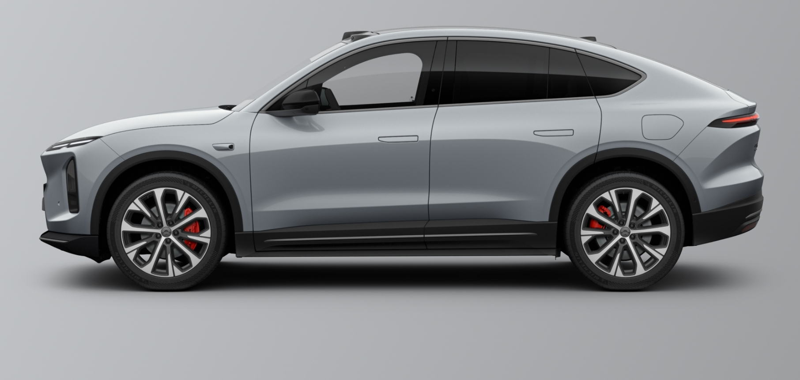
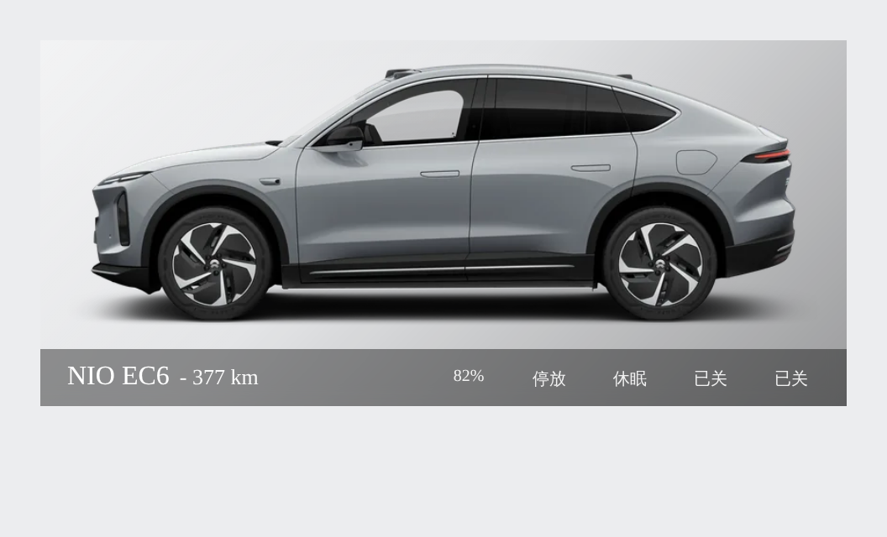

# ha-nio

Home Assistant custom integration for **NIO** electric vehicles (EC6/ES6/ET5…),
built on the same private API the NIO iOS app uses (`icar.nio.com`). There is
no official NIO integration — this one gives you battery, range, doors/windows,
driving state and a live map position (GCJ-02 → WGS-84 corrected, no offset in
mainland China).

## Entities

| Platform | Entities |
| --- | --- |
| `sensor` | Battery %, Range (CLTC), Range (actual), Range achievement rate, Vehicle state, Charging power, Inside/Outside temperature, Mileage, Tyre pressure ×4 (diagnostic), Firmware version (diagnostic) |
| `binary_sensor` | Driving, Sleeping, Doors, Windows, Lock, Charging, Cloud connection (diagnostic) |
| `device_tracker` | Vehicle location (WGS-84, registry-backed — survives restarts) |
| `button` | Refresh data (immediate poll) |

Polling is adaptive to be gentle on the private API (it rate-limits, and may
invalidate your token, if hammered): every 5 min while driving, 15 min in the
daytime, 30 min overnight. All intervals are configurable in the integration
options.

## Lovelace card

The integration ships a custom card — **NIO Car Card** — and registers it
automatically (no manual Lovelace resource, no extra HACS frontend install).
After the integration loads, it appears in *Add card* as **NIO Car Card**.

It shows the official factory render for your car, a glass status bar (title +
CLTC range), five state icons (battery / driving / sleeping / doors / windows,
with red alerts when a door or window is open), and a tap-to-open popup with the
full status breakdown plus a refresh button.

Everything is set in the **visual editor** — pick the car (NIO device), model
and body colour from swatches; no YAML required:

| Option | Effect |
| --- | --- |
| Vehicle | The NIO device — entities are resolved from its registry, so renamed entity ids keep working |
| Model / Colour | Selects the bundled render; 9 models, every factory colour |
| Name | Card title (defaults to `NIO <MODEL>`) |
| Background colour | Studio backdrop tint behind the (transparent) car |
| Background gradient | Top-left-light → bottom-right-dark studio sheen (on by default) |
| Bar colour / opacity | Status-bar colour and translucency; icon/text colour auto-inverts for contrast |
| Show labels | State text under each icon; the bar auto-grows and the car scales to never be covered |
| Background image URL | Optional — overrides the backdrop colour with your own image |

Zero frontend dependencies: the popup, styling and editor are all self-contained
(no `card_mod` / `browser_mod` / `streamline-card`). A plain `picture-glance`
fallback snippet is in [`lovelace/`](lovelace/) for anyone who prefers raw YAML.

> [!NOTE]
> Car renders are the manufacturer's official press/configurator images,
> bundled for convenience and trimmed/feathered for the card. They remain the
> property of NIO Inc.; this project claims no rights over them.

## Installation

### HACS (custom repository)

1. HACS → Integrations → ⋮ → *Custom repositories*
2. Add `https://github.com/genelee26/ha-nio` as type *Integration*
3. Install **NIO**, restart Home Assistant

### Manual

Copy `custom_components/nio/` into your HA `config/custom_components/` and
restart.

## Setup

The integration authenticates by replaying the app's own request, so you need
to sniff it once:

1. Put an MITM proxy (mitmproxy / Charles / Surge / Quantumult X…) between your
   phone and the internet, trust its CA certificate.
2. Open the NIO app, pull-to-refresh the vehicle page.
3. Find the request to
   `https://icar.nio.com/api/2/rvs/vehicle/<vehicle_id>/status?...`
4. Copy **the full request URL** and the **`Authorization: Bearer …` token**.
5. In HA: *Settings → Devices & services → Add integration → NIO*, paste both.

`vehicle_id`, `device_id`, `sign`, `timestamp`, `app_ver` and `region` are
parsed from the URL automatically and stored in HA's encrypted config storage —
no plaintext YAML.

> [!WARNING]
> The Bearer token is your NIO account session credential — treat it like a
> password. This integration is **read-only** (it never sends commands), but
> the token itself would allow remote vehicle control elsewhere.

When the token eventually expires, HA raises a re-authentication notification —
sniff a fresh token and paste it. No restart needed.

## Notes

- **Coordinate correction**: positions from the API are GCJ-02 (mandatory
  obfuscation in mainland China). The device tracker converts to WGS-84
  in-process using the standard 7-parameter approximation, so HA's map shows
  the true position.
- **Door semantics** are field-tested on a real EC6 (every opening cycled and
  matched 1:1 against raw API captures): `*_ajar_status` `1` = closed, `0` =
  open; `vehicle_lock_status` `1` = locked, `0` = unlocked. Window `win_*_posn`
  follows the legacy YAML behaviour (`0` = closed, `>0` = open). If your car
  reports differently, please open an issue with the `door_status` payload.
- A "battery low → swap reminder" stays a user automation on purpose — trigger
  on `sensor.<vehicle>_remaining_actual_range` at the time of day that suits
  your nearest swap station.

## Migrating from the YAML bundle

If you used the previous scattered-YAML version (`rest_nio_car.yaml`,
`ct_nio_data_master.yaml`, `update_nio_location.py`, the refresh automations):

1. Set up this integration first and verify entities populate.
2. Remove the YAML includes, the `shell_command`, the python script and the
   two refresh/location automations.
3. Delete leftover registry entries (e.g. `sensor.nio_vehicle_tracker_2`) in
   *Settings → Entities*.
4. Repoint dashboard cards: entity ids are now prefixed with the device name
   (e.g. `sensor.nio_ec6_battery`, `device_tracker.nio_ec6_location`).

## Disclaimer

Not affiliated with NIO Inc. Uses an undocumented private API that may change
or break at any time. Use at your own risk.
